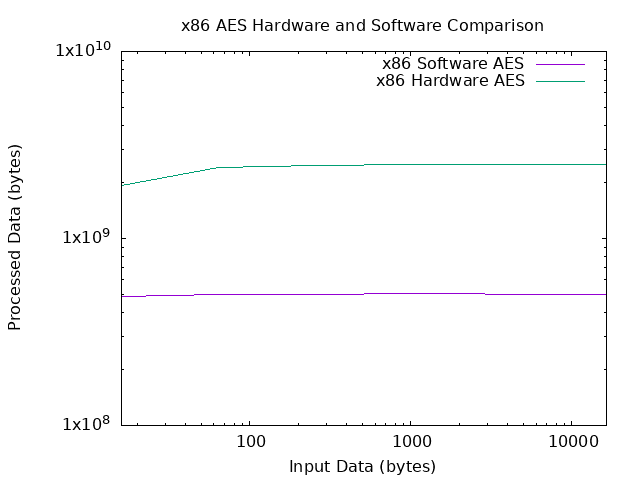

# Secure Hardware Computing

## Table of Contents

* [Prerequisites](#prerequisites)
* [Introduction](#introduction)
* [Cryptography](#cryptography)
  * [x86 Cryptographic Intruction Sets](#x86-cryptographic-intruction-sets)
    * [Intel AES-NI](#intel-aes-ni)
      * [Challenge: AES in C](#challenge-aes-in-c)
      * [Challenge: AES in ASM](#challenge-aes-in-asm)
    * [Intel SHA-NI](#intel-sha-ni)
      * [SHA-1](#sha-1)
      * [SHA-256](#sha-256)
    * [Performance Evaluation](#performance-evaluation)
      * [Tutorial: Comparing AES-NI and the Software Implementation](#tutorial-comparing-aes-ni-and-the-software-implementation)
      * [Activity: Comparing SHA-NI and the Software Implementation](#activity-comparing-sha-ni-and-the-software-implementation)
  * [ARM Cryptography Extensions](#arm-cryptography-extensions)
* [Hardware Random Number Generation](#hardware-random-number-generation)
    * [RDRAND](#rdrand)
    * [RDSEED](#rdseed)
      * [Challenge: RDRAND and RDSEED in Assembly](#challenge-rdrand-and-rdseed-in-assembly)
    * [GCC Compiler Intrinsics](#gcc-compiler-intrinsics)
      * [Challenge: RDRAND and RDSEED in C](#challenge-rdrand-and-rdseed-in-c)
      * [Challenge: Performance Evaluation](#challenge-performance-evaluation)
    * [Exploiting RDRAND and RDSEED?](#exploiting-rdrand-and-rdseed)
    * [When to Use RDRAND and RDSEED?](#when-to-use-rdrand-and-rdseed)
* [Trusted Computing](#trusted-computing)
  * [Trustsed Platorm Module](#trusted-platform-module---tpm)
    * [Exploiting the TPM](#exploiting-the-tpm)
    * [Tutorial: Sign with RSA](#tutorial-sign-with-rsa)
    * [Discover: AES Decryption](#challenge-aes-decryption)
    * [Tutorial: Seal Arbitrary Data](#tutorial-seal-arbitrary-data)
* [Resources](#resources)
* [Further Reading](#further-reading)

## Prerequisites

For this session you should have some knowledge about `AES`, `SHA`, `SIMD instructions` from Intel, and `x86_64` assembly.
For the x86_64 assembly, please review the **Security Essentials** [Assembly Language](https://github.com/security-summer-school/essentials/tree/master/assembly-language) and [Taming the Stack](https://github.com/security-summer-school/essentials/tree/master/taming-the-stack) sessions.

## Introduction

In terms of computing, the tendencies are to require more information to be processed, as fast as possible and as secure as possible.
And usually, the best way to ensure the maximum computation speed is to move the processing from software to hardware.
That's why most systems have specialised hardware components, that are able to do some of the most common operations: checksum computing for network packets, basic routing, encrypting and decrypting, hashing, random number generation.
Some of these operations are critical in ensuring the security of a system.
In this session we will explore some of those:
 * Encryption and decryption on Intel and ARM CPUs, in particular the AES algorithm
 * Random number generation

After studying these concepts, we have one more topic: can we trust the hardware?
Many people have posed this question, including tech giants.
Those questions resulted in the creation of the **Trusted Computing** concept.
We'll see what it is and how it is implemented. 

## Cryptography

### x86 Cryptographic Intruction Sets

#### Intel AES-NI

One of the most common algorithms used for encryption and decryption is AES (Advanced Encryption Standard).
As its name suggests, AES is the standard for securing data that cannot (should not) be intercepted over a network.
It is used to encrypt certain files, whole disks, by password managers to store passwords, and other uses.
Being used so much, it was only natural that the most efficient implementation was searched.
And, generally, the most efficient implementation of an algorithm is directly in the hardware.

A hardware implementation has one more benefit: it is more secure.
If done by software, while being secure against brute-force attacks, AES can be broken using side-channel attacks.
The hardware implementation is much harder to be affected by such attacks.

In 2008, Intel proposed an AES instruction set for the x86_64 CPUs, AES-NI (Advanced Encryption Standard New Instructions).
AMD also implemented the instruction set for their CPUs.

The instruction set provides 2 instructions for encrypting, 2 for decrypting, and 2 for key generation:
 * `AESENC` performs an encryption round
 * `AESENCLAST` performs the last encryption round
 * `AESDEC` performs a decryption round
 * `AESDECLAST` performs the last decryption round
 * `AESKEYGENASSIS` aids in the key expansion phase of the algorithm
 * `AEIMC` prepares a key for being used in decryption

All the instructions use XMM registers, which are part of the SSE / AVX instruction sets.

In the case of the first 4 and the 6th instructions, 2 XMM registers are used: the first one stores the intermediary state of the cyphertext, and the second one the key used in that round.

For those of you that don't like the Assembly language, there are good news.
The AES-NI instructions can be also used in C, not only in Assembly, with the so-called [intrinsic functions](https://www.intel.com/content/www/us/en/docs/intrinsics-guide/index.html#othertechs=AES).

The tasks for this part will be straight-forward:

##### Challenge: AES in C

You are provided with an implementation of AES encryption, in C.
Complete the code with the decryption implementation, obtain the flag and submit it.

You can find the task resources [here](https://github.com/security-summer-school/hardware-sec/tree/hardware-computing/hardware-computing/activities/aes-in-c).

##### Challenge: AES in ASM

You are provided with an implementation of AES encryption, in Assembly.
Complete the code with the decryption implementation, obtain the flag and submit it.

You can find the task resources [here](https://github.com/security-summer-school/hardware-sec/tree/hardware-computing/hardware-computing/activities/aes-in-assembly).

#### Intel SHA-NI

Hashing algorithms are used today to verify authenticity and integrity of data, and for password storage.
For example, when you download a file, you are also provided with the hash of that file.
You are then able to compute the hash locally, and see if the hashes match.
If not, the file has been corrupted.
Computing hashes is a time-consuming task, especially when dealing with large files.

In order to reduce computing times, some of the hashing algorithms used today were moved into hardware.
Intel provides `SHA-NI`, an instruction set to perform `SHA-1` and `SHA-256` hashing.

##### SHA-1

`SHA-1` is the first widely-used SHA variant.
It outputs 20-byte long hashes, from input of any size.
The input is split into blocks of 64 bytes, then passed through a series of rounds.
If the last block has a size of less than 64 bytes, it is extended.
The Intel instructions provide support only for performing the rounds, which are the computation-intensive part of the algorithm.

The instructions provided are:
* `SHA1RNDS4`, which performs four rounds of SHA1
* `SHA1NEXTE`, which computes the state for the next 4 rounds
* `SHA1MSG1` and `SHA1MSG2`, which prepare the next words of the block

##### SHA-256

`SHA-256` is a variant of the `SHA-2` standard, which outputs 256-bit hashes.
As for `SHA-1`, Intel provides instructions for performing the rounds.
Those instructions are:
* `SHA256RNDS2`, which performs 2 rounds of the `SHA-256` algorithm
* `SHA256MSG1` and `SHA256MSG2`, which prepare the next words of the block

You can check how SHA1 would be implemented using the `SHA-NI` instructions, [here](./activities/sha1-in-c/public/).
But you can see an issue with hardware implementations of cryptographic algorithms:
you must know the algorithms very well to use them.
So we will skip further code writing and measure the impact of those instruction sets.

##### Security of SHA-NI

Like `AES-NI`, it is very hard to exploit the instruction set, as it requires direct access to the physical CPU.
That doesn't mean the hash itself can't be broken.
`SHA-1` was proven to be insecure, and broken.
You can read more about it [here](https://shattered.io/).

#### Performance Evaluation

Let's see how much better is a hardware implementation, compared to a software one, in terms of speed.
We will use `openssl` to compare the hardware implementation and the software one, for both `AES` and `SHA`.

##### Tutorial: Comparing AES-NI and the Software Implementation

We will first check the AES-NI implementation, which is used by default by `openssl`.
To do this, we run:

```
openssl speed -elapsed -evp aes-128-cbc
```

This command will run AES on various data sizes, then report the number of processed bytes per second.

Now let's run without AES-NI.
For this, we must disable it explicitly, like this:

```
OPENSSL_ia32cap="~0x200000000000000" openssl speed -elapsed -evp aes-128-cbc
```

The `OPENSSL_ia32cap` option is described [here](https://www.openssl.org/docs/man3.1/man3/OPENSSL_ia32cap.html).

We can now create a graph, using GNUPlot.
From [here](./activities/crypto-performance-evaluation/public/aes_x86/) run

```
gnuplot aes_x86.gnuplot
```

You will obtain a `.png` graph, like the one below.



You can see a big boost of performance, almost x5.

The numbers in the `.csv` file are results obtained on my PC, that uses an Intel i9-12900KS processor.
Place in the numbers obtained on your local system.

##### Activity: Comparing SHA-NI and the Software Implementation

Do the same measurements for SHA1 and SHA256.
You will have to change the `OPENSSL_ia32cap` option.

### ARM Cryptography Extensions

While Intel and AMD provide the AES-NI instruction set with all their newer processors, ARM provides such instructions as an optional extension module, called the "Cryptography Extension".
This module is available with the ARMv8 base Instruction Set Architecture.

We won't go into writing code that uses the cryptographic instructions.
We will just measure their performance.
For this we need a board that has the Cryptographic Extension implemented, and one without.
We will use OrangePi 5 as the board with cryptographic instructions, and RaspberryPi 4B as the one without.

If you want to read more about the ARM Cryprtographic Instructions, you can find resources in the [Further Reading](#further-reading) section.

This year, the instructor will show you how the boards compare, because there is no public access to the boards.

## Hardware Random Number Generation

Randomness, also called entropy, is essential in security, being used in generating encryption and decryption keys.
However, ensuring true randomness on a system is a difficult task, which is subject of many research papers.
Usually, random numbers are generated by a **(Pseudo)Random Number Generator - (P)RNG** component on the system, using hardware and software events that can't be easily predicted: cpu frequency at a given time, the number of interrupts, hashes of network packets, movement of the mouse, etc.
Those RNG components are most of the times software.
Considering this, Intel has implemented hardware RNGs on their processors, which are more secure than their software counterparts, being hard to predict.
The values returned by those RNGs can be read using the `RDRAND` and `RDSEED` instructions.

### RDRAND

`RDRAND` is the first implemented instruction on the Intel CPUs.
At the moment of its apparition, it wasn't secure, as it could be intercepted by side-channel attacks.
One such attack is the _CrossTalk_, designated as [CVE-2020-0543](https://www.intel.com/content/www/us/en/security-center/advisory/intel-sa-00320.html).
The reported vulnerabilities were patched, and `RDRAND` is considered secure nowadays. 

Intel guarantees that the generated random number cannot be predicted by an attacker that has finite resources.
That means that the effort needed to predict the number is a lot more higher than the benefits of predicting the random number, but it theoretically could be predicted.
It also isn't a true random number, but a pseudo-random number.

Using `RDRAND` is fairly easy: after calling `rdrand`, a number will be returned in the register provided as argument.
The number is a valid random number if the Carry Flag is not 0 after the instruction executes.

### RDSEED

`RDSEED` is the slower and harder to predict variant of `RDRAND`.
If `RDRAND` can be theoretically predicted, Intel guarantees that the number generated by `RDSEED` cannot be predicted by an attacker with infinite resources.

#### Challenge: RDRAND and RDSEED in Assembly

This task is very easy: generate some random numbers using the `rdrand` and `rdseed` instructions, in assembly.
Use the `$ make run` command to run your program.
It emulates the rdrand and rdseed commands, in case they are not supported on your system.

You can find the task resources [here](https://github.com/security-summer-school/hardware-sec/tree/hardware-computing/hardware-computing/activities/rdrand-and-rdseed-in-assembly).

### GCC Compiler Intrinsics

As most special hardware features, intrinsic functions are implemented in C, as wrappers to `RDRAND` and `RDSEED`.
Those are `_rdrand<size>_step()` and `_rdseed<size>_step()`, where "size" can be 16, 32, or 64.

#### Challenge: RDRAND and RDSEED in C

Again, a simple task. Generate some random numbers in C, using the compiler [intrinsic functions](https://www.intel.com/content/www/us/en/docs/intrinsics-guide/index.html#othertechs=RDRAND,RDSEED).

You can find the task resources [here](https://github.com/security-summer-school/hardware-sec/tree/hardware-computing/hardware-computing/activities/rdrand-and-rdseed-in-c).

#### Challenge: Performance Evaluation

Read some values from `/dev/urandom`, and compare the time it takes to do so with the time it takes to read the same number of values using `rdrand`.

You can find the task resources [here](https://github.com/security-summer-school/hardware-sec/tree/hardware-computing/hardware-computing/activities/performance-evaluation).

### Exploiting RDRAND and RDSEED?

Theoretically, there are exploits, that can leak the values of RDRAND and RDSEED.
But the attack is very hard to replicate, so we won't do it.
If you want to have a go at it, you can read the article describing CrossTalk, in the Resources section.
Contact your trainer for details on how to do it.

### When to Use RDRAND and RDSEED?

There are software solutions that are much faster than the hardware RNGs provided by Intel, so why use them?
The RDRAND and RDSEED instructions perform better when cryptographically secure random numbers are needed.

## Trusted Computing

The concept of **Trusted Computing** was introduced by Trusted Computing Group, and it aims to give the hardware control over waht software can be run on it, by being able to refuse to run unsigned software.
This enforcement means that the system will most of the times behave as expected.
For a system to fall under the Trusted Computing standard, it needs to have some components:
  * secure input and output - the sensitive data must not be able to be intercepted by a third party
  * an endorsment key - a public / private key, created at manufacture time, used to prove the identity of the system; the private key must never leave the chip where it is stored
  * memory curtailing - the system must provide full isolation of some sensitive areas of memory, blocking even the Operating System from accessing them
  * sealed storage - the system must provide a storage space, where private data can be stored and extracted only at a certain software-hardware configuration state
  * remote attestation - the system must allow authorised parties to detect changes in the system.
  For example, any changes done to a software by the user and not approved by the vendor, can be detected, using a certificate generated by the hardware
  * trusted third party - to maintain annonimity, a system will not communicate to another system that it's running verified hardware and software directly, as this may allow the receiver of this information to identify the sender.
  Instead, a third party will verify that the first system is non-altered, and will relate that to the second system

All of those concepts are included on most of today's x86_64 systems, using a hardware chip, called a **Trusted Platform Module**.
Most ARM CPUs also have a component that embodies the Trusted Computing concepts, called TrustZone, which will be discussed in the 4th session, Trusted Execution Environments.

### Trusted Platform Module - TPM

The TPM is usually a chip, residing on the motherboard.
More recent CPUs come with a TPM implementation, so the external chip is no longer required in their case.
Any TPM chip must implement the Trusted Computing standard, meaning that it must implement the 6 components from above.
The current version of the TPM is 2.0, and is mandatory in order to run some software, like Windows 10 and 11.
The user can interact with the TPM using special libraries.
For today's session, we will use bash commands, and the [tpm2-tools](https://github.com/tpm2-software/tpm2-tools) suite.
Particularly usefull is the [man folder](https://github.com/tpm2-software/tpm2-tools/tree/master/man).

To install `tpm2-tools`, run

```
$ sudo apt install tmp2-tools
```

If you aren't running native Linux, TPM may not work (especially on WSL).
A TPM simulator is needed.
Follow the following steps to install and run the simulator:

```
$ sudo apt install tmp2-tools tpm2-abrmd
$ mkdir ibmtpm && cd ibmtpm
$ wget https://sourceforge.net/projects/ibmswtpm2/files/latest/download -O ibmtpm.tar.gz
$ tar -zxvf ibmtpm.tar.gz
$ cd src/
$ make -j $(nproc)
$ sudo make install
$ sudo tpm_server
```

In another terminal, run

```
sudo tpm2-abrmd --allow-root --tcti=mssim --logger=stdout
```

Finally, in a 3rd terminal, run
```
export TPM2TOOLS_TCTI_NAME=socket
```

You are now able to run TPM commands.

#### Exploiting the TPM

If exploiting the RDRAND and RDSEED instructions seems hard and unreliable, TPM is almost impossible to be exploited without direct access to the chip.
You can find the CVEs in the [Further Reading](#further-reading) section.
So, for today's session, we won't try to break the TPM, but we will instead use it to perform several operations.

#### Tutorial: Sign with RSA

In order to use a key to sign a certificate (or anything else) with RSA, the keys must be created first.
In TPM, a RSA key-pair is an object, and a child of a primary object.
The first step is to create a primary object, using the following command: (must be root)

```
tpm2_createprimary -C e -c primary.ctx
```

The `-C e` argument creates the primary object under the `TPM_RH_ENDORSEMENT` hierarchy, which is controlled by the administrator (the user).
The `-c` option is used to provide a place to store the context of the object, which is used to identify that object in the future.

Then, we create a child object, the RSA key-pair.

```
tpm2_create -G rsa -u rsa.pub -r rsa.priv -C primary.ctx
```

Before we can use the key-pair, we must load it into the TPM.

```
tpm2_load -C primary.ctx -u rsa.pub -r rsa.priv -c rsa.ctx
```

Now we can use the loaded key-pair to sign (encrypt) and verify the signature of any file.

```
tpm2_sign -c rsa.ctx -g sha256 -o sig.rssa sign_me.dat
```

The last command generates a signed file, `sig.rssa`.
To verify that the signature is valid, we can use

```
tpm2_verifysignature -c rsa.ctx -g sha256 -s sig.rssa -m sign_me.dat
```

If the signature is valid, no output will be returned.
Try to modify `sign_me.dat`, and recheck the signature.

You can find the task resources [here](https://github.com/security-summer-school/hardware-sec/tree/hardware-computing/hardware-computing/activities/tpm-rsa).

#### Discover: AES Decryption

Someone left an encrypted file here, along with the AES key that was used.
Can you decrypt the file?
Why not?

Use `man tpm2` to find the commands needed.

You can find the task resources [here](https://github.com/security-summer-school/hardware-sec/tree/hardware-computing/hardware-computing/activities/tpm-aes).

#### Tutorial: Seal Arbitrary Data

TPM allows the user to seal data inside the hardware module.
The maximum size of the data that can be sealed is 128 bytes.
To seal data, we use the following command.

```
tpm2_create -C primary.ctx -i seal_me.dat -u seal.pub -r seal.priv -c seal.ctx
```

We can add an authorization policy to the sealed object, based on the `Platform Configuration Registers` - PCR.
Those registers are set up at boot time, and can be used to verify that the system is a valid state, before being able to unseal an object.

To read the PCR, we can use 

```
tpm2_pcrread -o pcr.bin sha256:0,1,2,3
```

This command reads from the registers from 0 to 4, from the `sha256` bank of registers, and stores the results in `pcr.bin`.
Then we can create a policy, that allows unsealing only if `sha256:0,1,2,3` are in the state described in `pcr.bin`.

```
tpm2_createpolicy -Q --policy-pcr -l sha256:0,1,2,3 -f pcr.bin -L pcr.policy
```

Then, seal the data using the new policy

```
tpm2_create -C primary.ctx -i seal_me.dat -u seal.pub -r seal.priv -L pcr.policy -c seal.ctx
```

To unseal the data, we can use

```
tpm2_unseal -c seal.ctx -p pcr:sha256:0,1,2,3
```

You can find the task resources [here](https://github.com/security-summer-school/hardware-sec/tree/hardware-computing/hardware-computing/activities/tpm-seal).

## Resources

* [Intel AES-NI White Paper](https://www.intel.com/content/dam/doc/white-paper/advanced-encryption-standard-new-instructions-set-paper.pdf)
* [Intel AES-NI Intrinsic Functions](https://www.intel.com/content/www/us/en/docs/intrinsics-guide/index.html#othertechs=AES)
* [TPM 2.0 Specification](https://trustedcomputinggroup.org/resource/tpm-library-specification/)
* [Intel SHA-NI Specification](https://www.intel.com/content/www/us/en/developer/articles/technical/intel-sha-extensions.html)
* [Intel SHA-NI Intrinsic Functions](https://www.intel.com/content/www/us/en/docs/intrinsics-guide/index.html#othertechs=SHA)

## Further Reading

* [Windows ARM AES Intrinsics](https://docs.microsoft.com/en-us/dotnet/api/system.runtime.intrinsics.arm.aes?view=net-6.0)
* [Linux ARM AES Intrinsics](https://developer.arm.com/architectures/instruction-sets/intrinsics/#f:@navigationhierarchiesinstructiongroup=[Cryptography,AES])
* [ARM Extended Intruction Set - SIMD, AES, SHA, others](https://developer.arm.com/documentation/ddi0596/2020-12/SIMD-FP-Instructions/)
* [Intel DRNG Implementation](https://www.intel.com/content/dam/develop/external/us/en/documents/441-intel-r-drng-software-implementation-guide-final-aug7.pdf)
* [CrossTalk Paper](https://download.vusec.net/papers/crosstalk_sp21.pdf)
* [TPM Local Security Vulnerability - CVE-2018-6622](https://www.cvedetails.com/cve/CVE-2018-6622/)
* [TPM-FAIL - TPM Timing Attack - CVE-2019-11090 and CVE-2019-16863](https://tpm.fail/tpmfail.pdf)
* [TPM Device Driver Information Disclosure Vunerability - CVE 2021-1656](https://msrc.microsoft.com/update-guide/vulnerability/CVE-2021-1656)
* [Infineon TPM Vulnerability - CVE-2017-15361](https://www.dell.com/support/kbdoc/ro-ro/000144419/infineon-trusted-platform-module-tpm-vulnerability-cve-2017-15361-impact-status-on-dell-products)
